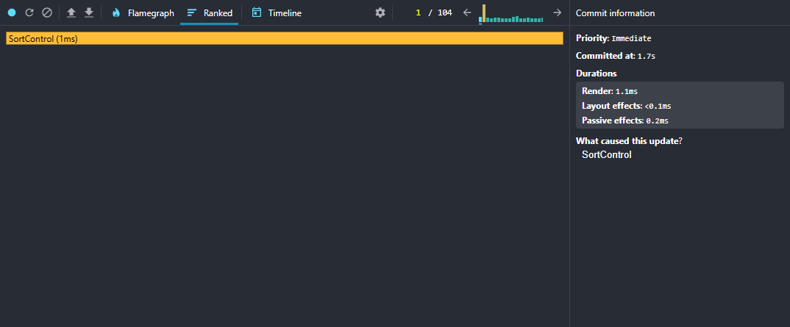
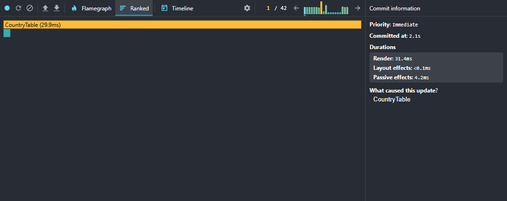
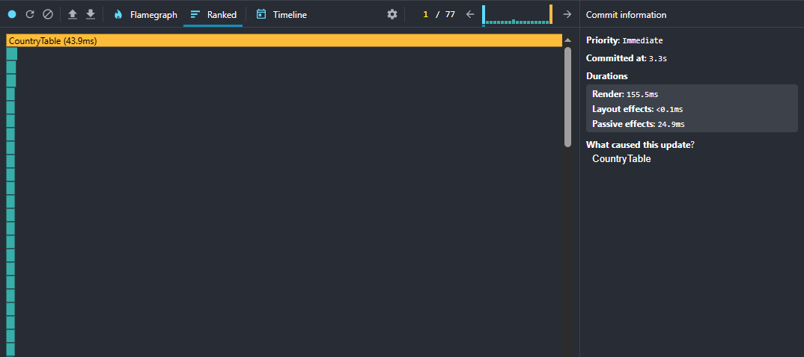
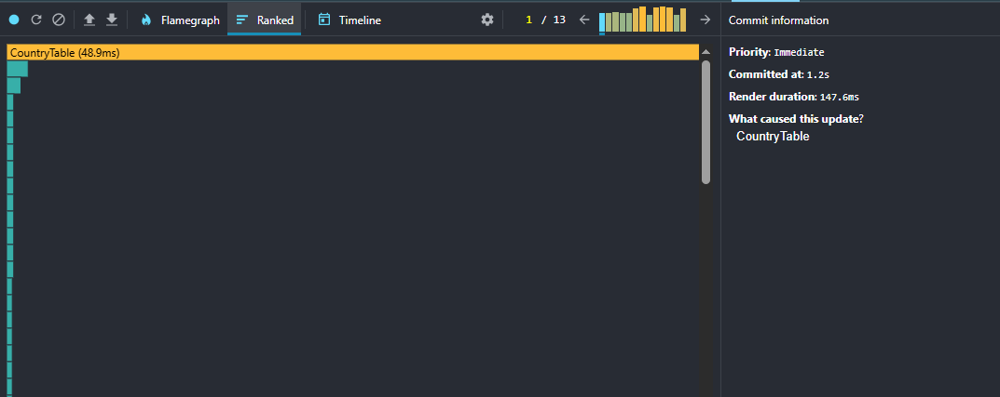
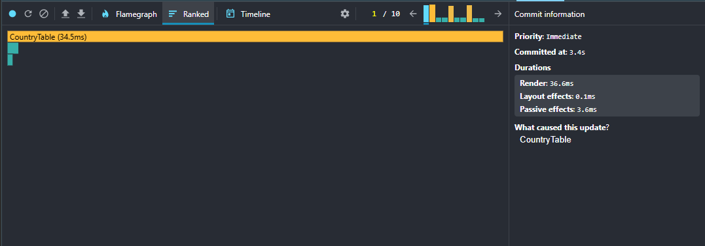
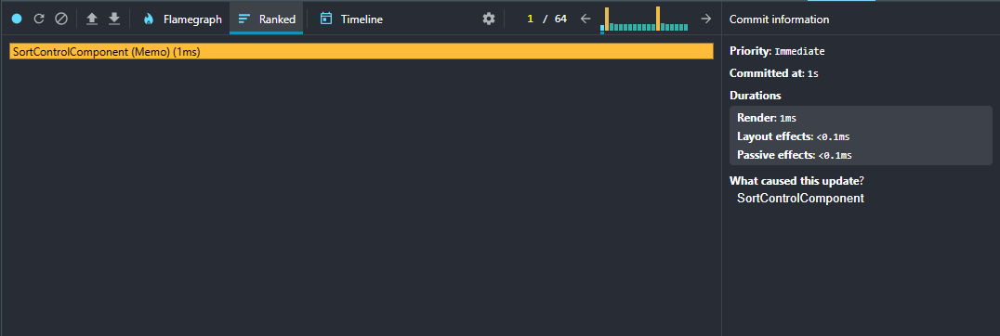
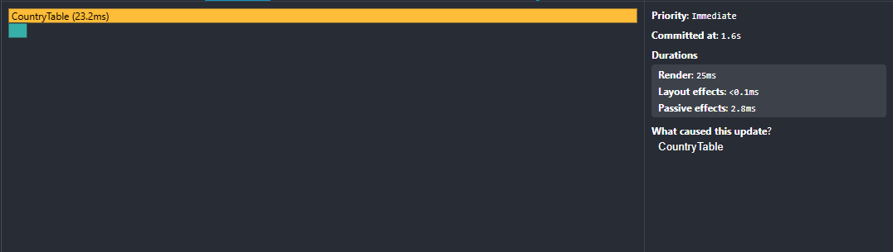
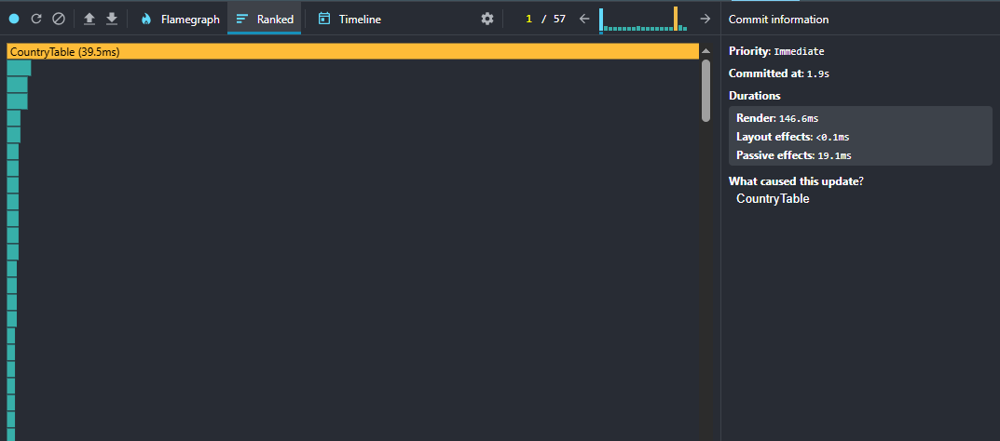
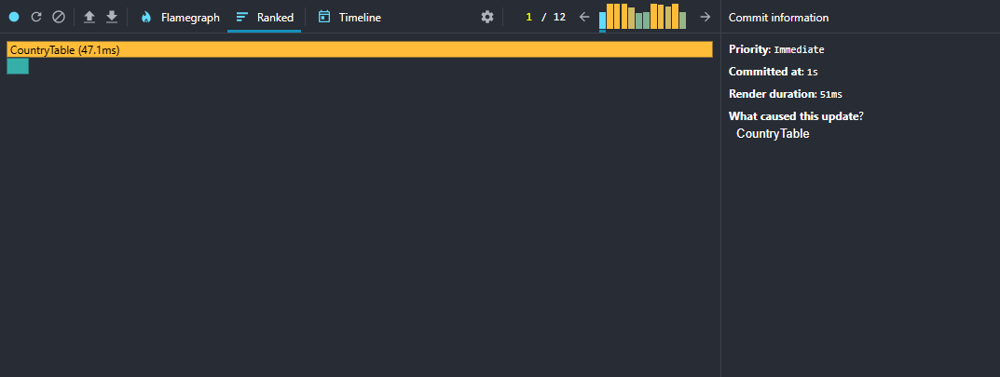
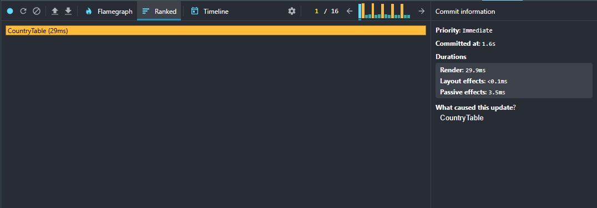

# CO2 Emissions Data App

Climate Dashboard Performance Report

## Quick Overview

I ran an initial performance check using **React DevTools Profiler** to see how my app handles typical user actions.  
I wanted to understand how long things take when I interact with sorting the table, searching for a country, filter regions, switching years, or adding/removing columns—and spot any areas that might be slowing it down.

---

## What I Measured

For each action, I recorded:

- **Commit Duration:** How long React took to apply updates.
- **Render Duration:** How long individual components took to render.
- **Interactions:** Which actions triggered the renders.
- **Flame Graphs:** Visual snapshots showing where components spend time rendering.
- **Ranked Charts:** Components sorted by render duration so I could see the heaviest ones.

---

## Performance Before Optimization

### Action: Sorting the table

- **Commit Duration:** <!-- 3.3s -->
- **Component Render Duration:** <!-- 0.7s -->
- **Interaction Captured:** <!-- Selecting sort option from dropdown -->

#### Visuals:

**Flame Graph:**  

**Ranked Chart:**  

---

### Action: Searching for a country

- **Commit Duration:** <!-- 2.1s -->
- **Component Render Duration:** <!-- 31.4s -->
- **Interaction Captured:** <!-- Typing in search field -->

#### Visuals:

**Flame Graph:**  

**Ranked Chart:**  

---

### Action: Switching years

- **Commit Duration:** <!-- 3.3s -->
- **Component Render Duration:** <!-- 155.5s -->
- **Interaction Captured:** <!-- Choosing year from dropdown -->

#### Visuals:

**Flame Graph:**  

**Ranked Chart:**  

---

### Action: Adding or removing columns

- **Commit Duration:** <!-- 1.2s -->
- **Component Render Duration:** <!-- 147.6s -->
- **Interaction Captured:** <!-- Checking/unchecking column checkbox -->

#### Visuals:

**Flame Graph:**  

**Ranked Chart:**  

### Action: Filtering by region

- **Commit Duration:** <!-- 3.4s -->
- **Component Render Duration:** <!-- 36.6s -->
- **Interaction Captured:** <!-- Selecting region from dropdown -->

#### Visuals:

**Flame Graph:**  

**Ranked Chart:**  

---

## Initial Observations

From what I measured:

- Sorting and searching feel smooth, but adding or removing columns triggers full table re-renders, which slows things down.
- Switching years is fairly quick, though for large datasets it could be optimized more.
- I think I can improve performance by using `React.memo` for components that don’t need to update every time, and `useMemo` for expensive calculations.

> This gives me a baseline to compare after optimizations.

---

## Performance After Optimization

### Action: Sorting the table

- **Commit Duration:** <!-- 1s -->
- **Component Render Duration:** <!-- 1s -->
- **Interaction Captured:** <!-- Selecting sort option from dropdown -->

#### Visuals:

**Flame Graph:**  

**Ranked Chart:**  

---

### Action: Searching for a country

- **Commit Duration:** <!-- 1.6s -->
- **Component Render Duration:** <!-- 25s -->
- **Interaction Captured:** <!-- Typing in search field -->

#### Visuals:

**Flame Graph:**  

**Ranked Chart:**  

---

### Action: Switching years

- **Commit Duration:** <!-- 1.9s -->
- **Component Render Duration:** <!-- 146.6s -->
- **Interaction Captured:** <!-- Choosing year from dropdown -->

#### Visuals:

**Flame Graph:**  

**Ranked Chart:**  

---

### Action: Adding or removing columns

- **Commit Duration:** <!-- 1s -->
- **Component Render Duration:** <!-- 51s -->
- **Interaction Captured:** <!-- Checking/unchecking column checkbox -->

#### Visuals:

**Flame Graph:**  

**Ranked Chart:**  

---

### Action: Filtering by region

- **Commit Duration:** <!-- 1.6s -->
- **Component Render Duration:** <!-- 29.9s -->
- **Interaction Captured:** <!-- Selecting region from dropdown -->

#### Visuals:

**Flame Graph:**  

**Ranked Chart:**  

---

## Observations After Optimization

- ✅ **Reduced unnecessary re-renders** with `React.memo`.
- ✅ **Expensive calculations cached** with `useMemo` and `useCallback`.

> Overall, the app seems smoother, with improvements in column toggling, filtering and year switching.  
